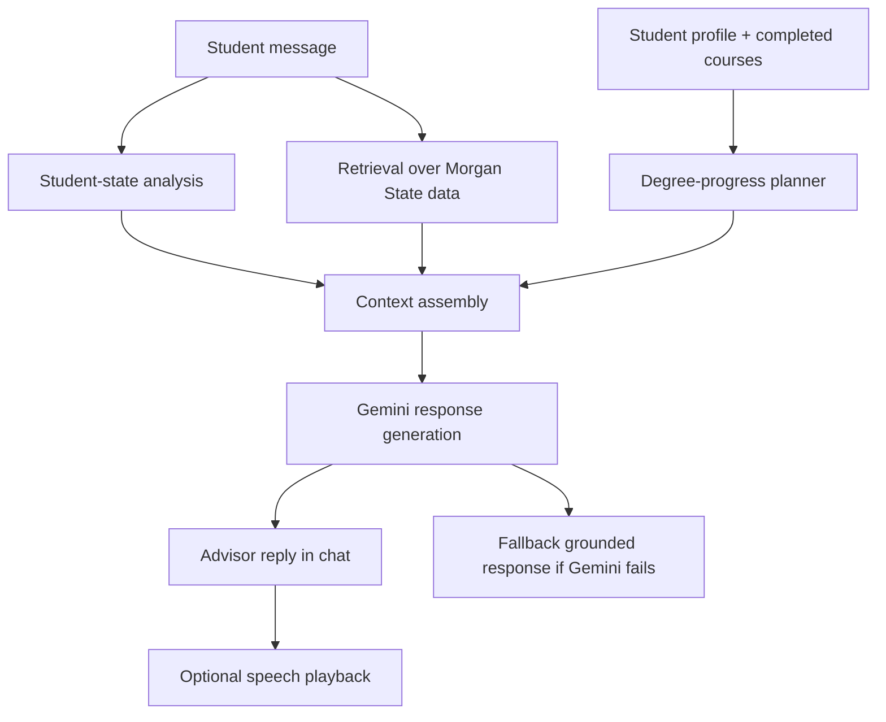

# System Architecture

## Goal

Build a multimodal university advising system that can support Morgan State students across majors, provide degree-planning guidance, surface relevant university contacts, and respond more carefully when a student may need support resources.

## System overview

The project uses a multi-stage advising pipeline instead of a single raw chatbot call:

1. Student profile layer
- Stores major, class year, and completed courses
- Drives personalized advising context

2. Degree-progress planner
- Compares completed courses against major requirements
- Computes remaining courses
- Recommends next courses
- Flags courses blocked by unmet prerequisites

3. Retrieval layer
- Pulls relevant Morgan State context from local knowledge sources
- Covers:
  - course catalog
  - departments
  - faculty
  - degree requirements
  - support resources

4. Student-state analyzer
- Detects likely advising intent
- Detects wellness-support signals in student language
- Helps the advisor respond more responsibly

5. Generative advisor
- Uses Gemini for final response generation
- Receives student profile, degree progress, student-state signals, and retrieved university context
- Falls back to grounded local advising output if the live AI service is unavailable

6. Multimodal frontend
- Text input
- Voice input through browser speech recognition
- Spoken replies through browser text-to-speech

## Knowledge sources

The retrieval layer currently uses CSV-backed data in `backend/data/`:

- `courses.csv`
- `degree_requirements.csv`
- `departments.csv`
- `faculty.csv`
- `support_resources.csv`
- `prerequisites.csv`

These sources allow the advisor to remain grounded in Morgan State-specific context rather than guessing.

## Advising pipeline

## Multi-model / multi-stage behavior

The assignment asks for more than a plain chatbot. This system now demonstrates a layered design:

- Retrieval model behavior:
  - keyword and context scoring over structured university data
- Planning logic:
  - prerequisite-aware course sequencing
- Student-state classification:
  - intent and support-signal detection
- Generative model:
  - final natural-language advising response
- Multimodal I/O:
  - speech input and speech output in the browser

Even though not every stage is a separate hosted ML service, the system clearly uses multiple reasoning layers instead of relying on one model call alone.

## Current strengths

- Personalized by major, year, and completed courses
- RAG-backed instead of free-form hallucination-first chat
- Stronger degree-planning support than a generic chatbot
- Better assignment alignment through audio input/output and support-aware behavior
- University-wide direction rather than Computer Science-only scope

## Current limitations

- Coverage still depends on the local advising datasets we provide
- Some majors have lighter source depth than others
- No image understanding pipeline yet
- Degree progress is requirement-based, not transcript-verified
- Student-state analysis is rule-based, not a full emotion model

## Best next upgrades

1. Add richer major coverage and source materials
2. Add transcript or degree-audit document ingestion
3. Add image or PDF-based advising input
4. Add stronger semantic retrieval embeddings
5. Add presentation/demo views for explaining the system to reviewers
